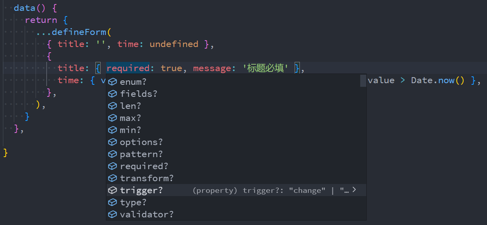
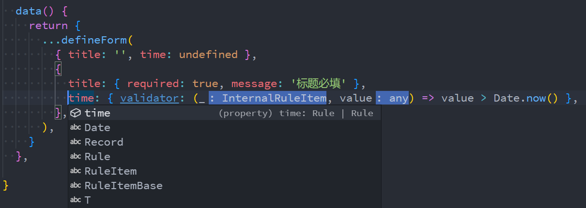

---
# try also 'default' to start simple
theme: seriph
# random image from a curated Unsplash collection by Anthony
# like them? see https://unsplash.com/collections/94734566/slidev
background: https://source.unsplash.com/collection/94734566/1920x1080
# apply any windi css classes to the current slide
class: 'text-center'
# https://sli.dev/custom/highlighters.html
highlighter: shiki
# show line numbers in code blocks
lineNumbers: false
# some information about the slides, markdown enabled
info: |
  ## Slidev Starter Template
  Presentation slides for developers.

  Learn more at [Sli.dev](https://sli.dev)
# persist drawings in exports and build
drawings:
  persist: false
# use UnoCSS (experimental)
css: unocss
---

# 在 JS 项目中引入类型化编程

一些经验分享

<div class="pt-12">
  <span @click="$slidev.nav.next" class="px-2 py-1 rounded cursor-pointer" hover="bg-white bg-opacity-10">
    START <carbon:arrow-right class="inline"/>
  </span>
</div>

<!-- <div class="abs-br m-6 flex gap-2">
  <button @click="$slidev.nav.openInEditor()" title="Open in Editor" class="text-xl icon-btn opacity-50 !border-none !hover:text-white">
    <carbon:edit />
  </button>
  <a href="https://github.com/slidevjs/slidev" target="_blank" alt="GitHub"
    class="text-xl icon-btn opacity-50 !border-none !hover:text-white">
    <carbon-logo-github />
  </a>
</div> -->

<!--
The last comment block of each slide will be treated as slide notes. It will be visible and editable in Presenter Mode along with the slide. [Read more in the docs](https://sli.dev/guide/syntax.html#notes)
-->

---

# 主题介绍

## 引入类型化编程是什么意思？

通过 TypeScript 引入类型系统和类型检查。

## 为什么选这个主题？

考虑到我们还存在许多 JS 项目需要持续迭代和维护。

---

# 为什么要引入类型化编程？

<div grid="~ cols-2 gap-4">
<div>

## JS 开发现状

- 反复切换文件查看逻辑和上下文？
- 怕写错单词所以经常复制粘贴？
- 经常需要运行代码看是否正确？
- 经常遇到各种运行时错误？
- 重构基本靠搜索替换？


</div>

<div>

## 引入类型化

- 🛡️✅ **更容易写出安全、正确的代码** - 类型检查、边界检查、错误检查，面向接口编程。
- 🚀 **研发效率** - 一次就写出正确的代码，不需要频繁运行和修改。
- 🧑‍💻 **开发体验** - 代码提示和补全。
- 📖⚒️ **易于维护** - 代码即文档，不用反复看源码理解，更容易进行 **重构**。

<div class="h-10"></div>

> 核心：将对程序的设计借助类型系统记录下来，并提供上下文提示以及类型安全检查，解放开发者心智负担。

</div>
</div>

---
layout: image-right
image: https://source.unsplash.com/collection/94734566/960x1080
---

# 引入类型化编程的方式？

**TypeScript** yyds

- 借助 TypeScript 的能力
  - 通过 <kbd>JsDoc</kbd> 注释来添加类型信息
  - 通过 <kbd>.d.ts</kbd> 文件来添加类型信息
  - 开启类型检查
- 直接将项目升级为 TypeScript 项目
  - 渐进式
  - 一步到位式

---

# 开发环境配置

## 插件

- **TypeScript** 配置项覆盖 JS/TS 开发的方方页面（格式化、语法、类型标注、类型检查等）。
  - Inlay Hints：标注自动推断的类型
  - jsconfig/tsconfig 配置项
  - 格式配置
  - 错误显示
- **ErrorLens** 自动将错误信息直接显示出来，不用再通过鼠标或者快捷键主动查看。
- **TypeScript Hero** 对 import 导入项进行排序及管理。
- **补全和自动导入** 如果有谁的编辑器不行的话，可以一起看下少了什么插件。

## 库

- **typed-install** 安装第 3 方库时，使用它的命令可以自动安装类型声明包

---

# tsconfig 顶层字段

- **extends** 用来继承其他配置
- **files** 当项目中只有少量文件时，把所有项目列到该选项中就行。
- **include** 用来定义项目包含哪些文件，支持 <kbd>glob</kbd> 语法，默认值：<kbd>**</kbd>。
  - glob 规则简述：<kbd>*</kbd> 匹配 0 到多个字符，<kbd>?</kbd> 匹配任意单个字符，<kbd>**/</kbd> 匹配任意目录（任意深度）。
  - 如果配置中不带后缀的话，默认匹配支持的文件类型（<kbd>.ts</kbd> <kbd>.tsx</kbd> <kbd>.d.ts</kbd>，<kbd>allowJs</kbd> 时还包括 <kbd>.js</kbd> <kbd>.jsx</kbd>）。
- **exclude** 仅用来从 <kbd>include</kbd> 中排除一些文件，配置方式与 <kbd>include</kbd> 相同。
- **compilerOptions** 其他绝大多数选项都是配置在该选项内。

---

# tsconfig 路径相关

- **baseUrl** 解析文件路径的根目录。默认 <kbd>'./'</kbd>，此时 <kbd>import * fom 'src/config'</kbd>，设置 <kbd>'./src'</kbd> 后： <kbd>import * from 'config'</kbd>。
- **rootDir** 项目文件根目录，编译生成的目录结构与该目录下目录结构一样。
  - 默认值：为能包含所有 <kbd>files</kbd> 或者 <kbd>include</kbd> 定义的所有文件的目录。比如：如果所有文件都在 <kbd>src/</kbd> 目录下，那就是 <kbd>src/</kbd>。
- **paths** 类似于 <kbd>Webpack</kbd> 中的 <kbd>alias</kbd>，可以使用类似 <kbd>'@/components'</kbd> 来简化路径。
  - 配置时的路径是 <kbd>baseUrl</kbd> 为基础的的相对路径。所以需要先配置 <kbd>baseUrl</kbd>。
  - 配置示例：`"paths": { "@/*": ["src/*"] }`，`"paths": { "utils/*": ["src/utils/*", "lib/utils/*"]}`。
- **outDir** 编译输出文件的根目录。
- **outFile** 如果定义了，所有非模块文件都被一起打包输出到该文件，如果 <kbd>module</kbd> 选项为 <kbd>System</kbd> 或 <kbd>AMD</kbd>，模块系统文件也会被打包到 global 后面。
  - <kbd>CommonJS</kbd> 和 <kbd>ES6</kbd> 模块不能通过设置该选项来打包 bundle 文件。

---

# tsconfig 编译及模块相关

- **target** 决定代码编译的目标版本：哪些语法会被降级编译，哪些会被保留。（前提：使用 tsc 编译）。
  - 常用值：<kbd>es5</kbd> <kbd>es6</kbd> <kbd>es2018</kbd> ... <kbd>es2022</kbd> <kbd>esnext</kbd>
  - 并会为 <kbd>lib</kbd> 选项添加对应 es 版本的内置类型声明。
  - 建议：一般不使用 tsc 编译的话，设置最新的 <kbd>es2022</kbd> 就好，如果编译不支持的话再降。
- **lib** 提供了 JS 内置 API(<kbd>Math</kbd>)、不同 ES 版本的语法(<kbd>Promise.allSettled</kbd> <kbd>Map</kbd>)、运行环境(<kbd>document</kbd>)等。
  - es 版本选项：除了像 target 一样的选项外，还可以精确到语法（如 <kbd>ES2022.Promise</kbd>）
  - 其他选项：<kbd>DOM</kbd> <kbd>DOM.Iterable</kbd> <kbd>WebWorker</kbd>
- **module** 定义最终生成的 JavaScript 文件的模块标准。
  - 包括常用的 <kbd>CommonJs</kbd> <kbd>ES6</kbd> <kbd>ES2020</kbd> <kbd>ESNext</kbd> 以及 <kbd>AMD</kbd> <kbd>UMD</kbd> <kbd>System</kbd> <kbd>Node16</kbd> <kbd>NodeNext</kbd> 等。
- **moduleResolution** 模块路径的解析策略。默认不一定是 <kbd>node</kbd>，绝大多数情况设置为 <kbd>node</kbd> 就好。
- **esModuleInterop** 允许 es 模块引入 cjs 模块，且使用 tsc 编译时还会处理原模块没有 default 导出的问题。
  - **allowSyntheticDefaultImports** 跟随 <kbd>esModuleInterop</kbd> 开启。<kbd>import * as X</kbd> 可简写成 <kbd>import X</kbd>。
- **isolatedModules** 保证每个文件都必须能够独立进行编译。当我们使用 <kbd>babel</kbd> 等其他编译工具来编译 TypeScript 代码时开启。

---

# tsconfig JavaScript 相关

- **allowJs** 开启后可以 <kbd>.ts</kbd> 文件中引入 <kbd>.js</kbd> 文件。
- 💡 **checkJs** 对 JavaScript 其他控制是否开启类型检查的方式：
  - <kbd>// @ts-check</kbd> 将该标记添加到文件顶部，可以单独开启该文件的类型检查。
  - <kbd>// @ts-nocheck</kbd> 将该标记添加到文件顶部，可以单独关闭该文件的类型检查。
  - 还可以通过 <kbd>include</kbd> 选项设置哪些属于项目文件从而开启类型检查。
  - <kbd>// @ts-ignore</kbd> 忽略下一行的类型错误（不管有没有错误）。不建议：可能不小心把不该忽略的给忽略了，例如之前要忽略的行被删除。❌
  - <kbd>// @ts-expect-error</kbd> 当下一行有错误时，不报错，下一行无错误时，会对该注释报错，提醒你删除该注释。

---

# tsconfig 类型检查

- **strict** 开启一系列严格检查选项：
  - **alwaysStrict** 开启 <kbd>"use strict"</kbd> 模式，且生成的 js 文件也会加上。
  - **strictNullChecks** 对 <kbd>null</kbd> <kbd>undefined</kbd> 的赋值类型检查更严格，且对可能为 <kbd>null</kbd> <kbd>undefined</kbd> 的变量使用前不进行判断处理会报错。
  - **strictBindCallApply** 对函数的 <kbd>call</kbd> <kbd>bind</kbd> <kbd>apply</kbd> 使用也进行参数类型检查 。
  - **strictFunctionTypes** 函数赋值时，对函数的参数开启类型检查。
  - **strictPropertyInitialization** 类的成员变量必须在声明时或者构造函数中赋初始值。
  - **noImplicitAny** 禁止隐式 <kbd>any</kbd> 类型（类型推断失败回退到 any）。刚入门或者处理不过来可先关闭。
  - **noImplicitThis** 禁止函数内的 this 为隐式 <kbd>any</kbd>： 函数内使用 this 时，必有明确其类型。
  - **useUnknownInCatchVariables** <kbd>try catch</kbd> 的 error 类型为 unknown，强制进行错误类型判断。
- **noImplicitOverride** 类继承时，要覆盖父类方法需要主动加上 <kbd>override</kbd> 标记。
- **noFallthroughCasesInSwitch** <kbd>switch case</kbd> 中各分支逻辑独立处理（必须有 <kbd>break</kbd> 或者 <kbd>return</kbd>)。
- **noImplicitReturns** 防止函数内有分支忘了处理返回值。

---

# tsconfig 其他

- **严格类型检查** 还有其他一些选项可以再去研究一下。
- **skipLibCheck** 跳过 <kbd>.d.ts</kbd> 文件的类型检查（可能其中有一些冲突），可以在一定程度上提升编译时性能，但会牺牲一定的类型准确性。

---

# tsconfig 配置参考

## Node.js项目

- [TypeScript官方推荐的一些基础配置](https://github.com/tsconfig/bases/)
- [Node.js 不同版本对 ES 标准的支持表](https://node.green/)

待补充

---

# jsconfig 配置参考

```json
{
  "compilerOptions": {
    "target": "ESNext",
    "module": "ESNext",
    "jsx": "preserve",
    "moduleResolution": "node",
    "esModuleInterop": true,
    "forceConsistentCasingInFileNames": true,
    "baseUrl": ".",
    "skipLibCheck": true,
    "checkJs": true,
    "lib": ["ESNext", "DOM", "ScriptHost"],
    "paths": {
      "@cards/*": ["./src/pages/cards/*"]
    }
  },
  "include": [
    "src/**/*",
    "src/**/*.vue"
  ],
  "exclude": [
    "node_modules/**/*"
  ]
}
```

---
layout: two-cols
---

# 类型声明

> 注意类型声明和普通 TypeScript 一样有 <kbd>模块</kbd> 的概念。
>
> 如果某一个文件中没有任何 <kbd>import</kbd> 或者 <kbd>export</kbd> 语句，那它就会被当成一个全局模块，其中定义的变量或者类型在其他文件中都可以直接使用而不需要导入。
>
> 否则，该文件内的所有变量或者类型定义都会变成模块内的，需要 <kbd>export</kbd> 后再由其他模块 <kbd>import</kbd> 导入来使用。

<br />

##### 全局声明

- 声明值：<kbd>declare ...</kbd>
- 声明接口或者类型：与 TypeScript 一样
- 声明命名空间：<kbd>declare namespace [Name]</kbd>
- 模块文件内全局声明：<kbd>declare global { ... }</kbd>

::right::

```ts
declare var __APP_NAME__: string;
declare function report(...args: any[]): void;
declare class User {}
```

```ts
interface Window {
  JSBridge?: { 
    callNative(method: string, data?: unknown, callback?: (...args: any[]) => void): void
  };
}
type MyElement = HTMLDivElement | HTMLSpanElement;
```

```ts
declare namespace GreetingLib {
  let name: string;
  interface Options {
    title: string;
  }
}
```

```ts
export class Test {};
declare global {
  interface String {
    reverse(): string;
  }
}
```

---

# 为一个模块扩展类型声明

待补充

```ts
// TODO: 待补充
```

---

# 模块扩展示例 - 神策上报

```ts assets.d.ts
import type { MarketType } from '@cards/constants/market-types';

export module 'vue/types/vue' {
  import Vue from 'vue';
  type ReportEvents = 'CouponCenterpageview' | 'SingleCardDetailspageview';
  interface ReportObjStock { stock_market: MarketType; stock_code: string; stock_name: string; view_duration: number; }
  interface ReportObjType { type: string; }
  interface ReportObjCouponType { coupon_type: string; }
  interface SDReportOptions {
    /** 上报的属性在第一次上报就决定了该属性的类型，且属性类型不可更改；初次上报某属性时，属性类型谨慎选择 选填，默认为{},需要上报到神策的对象，由产品给出 */
    reportobj?: ReportObjStock | ReportObjType | ReportObjCouponType;
    /** 神策上报的事件显示名称，由产品给出 */
    eventname?: ReportEvents;
  }

  interface Vue {
    $report: {
      /** 自定义神策上报 */
      sdReport(options: SDReportOptions): void;
      /** 广告归因+业务 神策上报 */
      sdABReport(options: SDReportOptions): void;
      /** 广告归因神策上报 */
      sdAdReport(content: string): void;
    };
  }
}
```

---

# 资源文件类型扩展

assets.d.ts

```ts
declare module '*.bmp' {
  const src: string;
  export default src;
}

declare module '*.gif' {
  const src: string;
  export default src;
}

declare module '*.jpg' {
  const src: string;
  export default src;
}

declare module '*.jpeg' {
  const src: string;
  export default src;
}

declare module '*.png' {
  const src: string;
  export default src;
}

declare module '*.webp' {
    const src: string;
    export default src;
}

declare module '*.svg' {
  const src: string;
  export default src;
}

declare module '*.css' {
  const src: string;
  export default src;
}

declare module '*.scss' {
  const src: string;
  export default src;
}

declare module '*.sass' {
  const src: string;
  export default src;
}
```

---

# 模块扩展示例 - 神策上报 - 效果


---

# JSDoc 相关重点知识点讲述及解答

[如何在JavaScript项目中使用TypeScript的能力](https://juejin.cn/post/7026907618438283271)

> 💡 配套代码里有一些 JSDoc 的 Demo。

---

# 常见类型问题处理以及避免

1. TS 项目中引入公司内部包报错找不到类型声明问题
   1. ❎  <kbd>declare module '@futu/xxx { export default any };</kbd>
   2. ✅  <kbd>include: ["node_modules/@futu/**/*"]</kbd>

---

# JS 项目渐近式升级 TS 的一些思路


1. <kbd>JS & JSDoc</kbd>：实现一些简单的类型化比较方便，不依赖配置、构建打包，缺点：书写稍麻烦
2. <kbd>JS/TS + .d.ts</kbd>：提供一些公共库的类型声明或者其他类型定义，完全跨语言支持，缺点：纯类型无逻辑
3. <kbd>Options-API</kbd> ==> <kbd>Composition-API</kbd>
4. 在前面的基础上增加 TS 构建打包及 eslint 的支持：综合体（<Kbd>TS + JS & JSDoc + .d.ts</kbd>）
5. 再进一步把原来不好类型化的地方实现类型化，甚至完全升级为 TS，最终实现项目的完全类型化。

<br />

> 补充：[ESLint插件及配置体系 包括Vue和TS](https://www.yuque.com/docs/share/a42f67f0-3e1e-4a03-a39b-6c01bad6c549?#)

---
layout: image
image: https://source.unsplash.com/collection/94734566/1920x1080
class: text-center
---

# 一些实战案例

---
layout: two-cols
---

# 案例一 FutureUI-Form 表单校验规则

1. 安装依赖 <kbd>npm i -D async-validate</kbd>
2. 新建工具函数：<kbd>defineForm</kbd>

```js
/** @typedef {import('async-validator').RuleItem} RuleItemBase */
/** @typedef {RuleItemBase & { trigger?: 'change' | 'blur' }} RuleItem */
/** @typedef {RuleItem | RuleItem[]} Rule */

/**
 * @template {Record<string, unknown>} T
 *
 * @param {T} formData
 * @param {Record<keyof T, Rule>} [formRules]
 * @returns {{ formData: T; formRules: Record<keyof T, Rule> }}
 */
export default function defineForm(formData, formRules) {
  return {
    formData,
    formRules,
  }
}
```

::right::




---

# 案例一 FutureUI-Form 表单检验规则 TS hooks 版

```ts
import { reactive, shallowRef } from '@vue/composition-api'
import { ElForm } from 'element-ui/types/form'
import { clone } from 'lodash-es'

import type { RuleItem as RuleItemBase } from 'async-validator'
type RuleItem = RuleItemBase & { trigger?: 'blur' | 'change' }
type Rule = RuleItem | RuleItem[]

export function useForm<T extends Record<string, unknown>>($formData: T, $formRules?: Record<keyof T, Rule>) {
  const formEl = shallowRef(null as unknown as ElForm)
  const formData = reactive(clone($formData))
  const formRules = reactive(clone($formRules || {}))
  /** 重置表单对象为默认值 */
  const onReset = () => {
    Object.assign(formData, clone($formData))
    Object.assign(formRules, clone($formRules))
    formEl.value.resetFields()
  }
  return {
    formEl,
    formData,
    formRules,
    onReset,
  }
}
```

---
layout: two-cols
---

# 案例二 JS & JSDoc + .d.ts

typings/user.d.ts

```ts
declare namespace User {
  export interface AccountDetail {
    id: number;
    currency: string;
    balance: number;
    enable: boolean;
  }

  export type AccountList = AccountDetail[];
}
```

some-file.js

```js
/**
 * @param {User.AccountDetail} account 账户
 * @param {Cards.ExperienceCard} card 体验卡
 */
function doSomething(account, card) {
  console.log(account.balance, card.market);
}
```

::right::

typings/cards.d.ts

```ts
declare namespace Cards {
  import { MarketType } from '@cards/constants/market-types';
  export interface BaseCard {
    id: string;
    name: string;
  }

  export interface VIPCard extends BaseCard {
    level: number;
    score: number;
  }

  export interface ExperienceCard extends BaseCard {
    status: number;
    validateBegin: number;
    validateEnd: number;
    market: MarketType;
  }

  export type Card = VIPCard | ExperienceCard;
}
```

> 注意点：jsconfig 中的 include 字段要把 typings/ 下的文件包含进来

---
layout: two-cols
---

# 案例三 枚举

```js
/**
 * @template T
 * @template {keyof T} [K=keyof T]
 * @typedef {K extends K ? T[K] : never} ValueOf
 */

/**
 * @enum {ValueOf<typeof CurrencyType>}
 */
export const CurrencyType = /** @type {const} */ ({
    CNY: "CNY",
    USD: "USD",
    HKD: "HKD",
});

/**
 * 币种 - 对应的符号
 * @type {Record<CurrencyType, string>}
 */
export const CurrencyToSignMap = {
    [CurrencyType.CNY]: '¥',
    [CurrencyType.USD]: '$',
    // Key不全 CurrencyToNameMap 会报错
    // [CurrencyType.HKD]: 'HK$',
};
```

::right::

```js
/**
 * @param {CurrencyType} currency
 */
function doSomethingWithCurrency(currency) {
    switch(currency) {
        case CurrencyType.CNY:
            console.log(currency);
            break;
        case CurrencyType.USD:
            console.log(currency);
            break;
        // 分支未处理完 NeverRun 会报错
        // case CurrencyType.HKD:
        //     console.log(currency);
        //     break;
        default:
            /** @type {never} */
            const NeverRun = currency;
    }
}

// 类型提示
doSomethingWithCurrency('CNY');
doSomethingWithCurrency(CurrencyType.CNY);
doSomethingWithCurrency('NOT_EXIST'); // 检查不通过
```

[💻在线查看](https://www.typescriptlang.org/play?noFallthroughCasesInSwitch=true&filetype=js#code/PQKhFgCgAIWgBALgUwLYAcA2BDF0AqUsCKGOeA3gNbICeA9gGYEC+0A2gNIC8NDz+ALpE4SWumQATZMwqdoyAB4oAdpIDO0eQH4CXQdABc0FcgBuyAE5sAatkwBXZAHlGI4FCigIMUchUOqNAUdo4ujAA8iOLITNAAwg6Wlv4AxrT4MQB8LO5QSuj0lojQqfQq6iWJyWkZMdDc0N4k9RRlFYhsIMDQABQURNBD8QByAJrGAESjY5MANINDAKoAygAiU6tr84vQABKcG9CTB9sLkCwAlADcnpDeItCAgHqAs57QALTQgJ-agCl6gCFugDJvQDvyo8xBJggAlZBlSySCLVFIqdKZCRzaCVSwASxUAHMcnlIAUiiV2pUEklEcj6CtMTiVABZbDoBrBXbsBG1FHIAB0M0ExgA5ABSgXnIZDdkUzkxblbfnQAUAElFu2APU4dEAsHKAC0VyTUkRl6CNsKhkIzmYAseUApUaATFTVT1JfrkTLTvKBQdlecWLdIF4wKD0NhLCbghyDVy2KkpQaCYwHEjEJjytBJNT6KbEAALbE4gDqmKzYfSvSjTtol1ZMHF6gA7gXUpmS9H0hWBlXxeLUth1Mg9ZS6hJeeNDLsOx3SfRMDzMPQcU2yzdR2OhgAjFLYKg+5dDLs9vvSwdbEft7c78rqSfT2fz-uLk+ntfIDdb7dq6CAMCVAPSmgCpzQAgmoAwF0AGO1oBGcwrAheNoGtO173FN9d17IsBx5U5j1PN9x3PS9uRnOdS1vF9lww8VH2fJchmkRhsAcTBEDQ084LAFpwQoUwLGsWAPFg5dSRKUD2IglQWXw2pCOgXILjuN9AG8fQBo9UABeNAC5PKBUxWdNkCzHN80LZtaF6AUZgFO9VPUzTcW0zMkN6JCuSHMY7zfQABi0AU-NNUALATAHH4lS0wzbNzILSzdP0kZnHwAB9ABRAANABJFZ8CMn0gA)
<span class="inline-block w-60"></span>
[💻TS版](https://www.typescriptlang.org/play?noFallthroughCasesInSwitch=true&filetype=ts#code/KYDwDg9gTgLgBMAdgVwLZwMLKlJBjATwBUCxg4BvAWACg57MA5ATTgF44AiDFzgGloM4AVQDKAEXZcx4-oIYAJANKSOnZbIE0AvgG5atAPQAqY4ONxAgHqBZzzgBaOIE-tQCl6gELdAZN6B35XOHaoSLBweBCIAM7wWDj4xBCiAJYA5ogAsgCGYABccABKwMFQACYAPJG4iIQkZHxw4VBxiAkAfFLUdAwA2qXRlcAAdDzMALpZAOQApSNaQp3YZRWkfTLDcCMAJJPy9IaGcErABICwcoAWipiz3RCMqajAaWBwgFjygKVGgJipm3DbcDNR5cQLvRrLEbKdZaPQGGi0ABmyHKMDiITgBViEGuMAAFvUEgB1OLoro-AAUeDOPyy+PmZAAlJQ3qEAO64vBookkwjU1pCIR4VKhcjk35kfosDJvTkMYJhCAAGz6UogCRZ3zZ+jaYqEACNcKkANYqtVBHl81kCxYSEWq-VBEKhaWy+WKuYESl6y30TXAHUusUfQBgSoB6U0AVOaAEE1AGAugBjtOCMYAAN2AUGyMIeL1FDA+3N5pyVJv+KnN+o+XOttt6coVxKzzpTWx2Gq1uqriOAkNSyClMDzrqtYXgUdj8ZhWUQMbjUnLjt07x2gDR-QCL0YA300AAxaAU-MG0J0VAIHS4EOtwBRHDQAkAA2EQ-AeRgwAKQWNWVWFDH0W0R+dk7ggAX4wAyEYuVxbtLR-whGgkVEFFgHRTEcTxY0CX5HohWYV8PgAeSUWgQLAiCGigtF+QJEYBhGJCdgOQBfgMAF7dAFLjQBMxUAHgV0ORVEMWw3FcJgkZGGQogAH1dwADQASVEIgiInD5lwOQAsBMAcfjaCAA)

---

# 案例三 多语言

待补充

---

# 可实践清单

- [ ]  VSCode 环境、插件配置
- [ ]  为项目添加 jsconfig/tsconfig
  - [ ]  保证每个 import 的文件都能点击跳转
  - [ ]  保证项目文件中的导出和第三方库都能提供代码补全（自动导入）及类型提示
- [ ]  为各种配置文件加上类型（eslint、webpack）
- [ ]  为项目内全局变量添加类型声明
- [ ]  为各种扩展插件添加类型声明
- [ ]  将原来分散的一组常量改成枚举写法
- [ ]  为公共逻辑添加合理的类型
- [ ]  为交互数据添加类型
- [ ]  新功能使用 Composition-API，或者考虑升级到 Vue2.7
- [ ]  考虑升级 TypeScript
