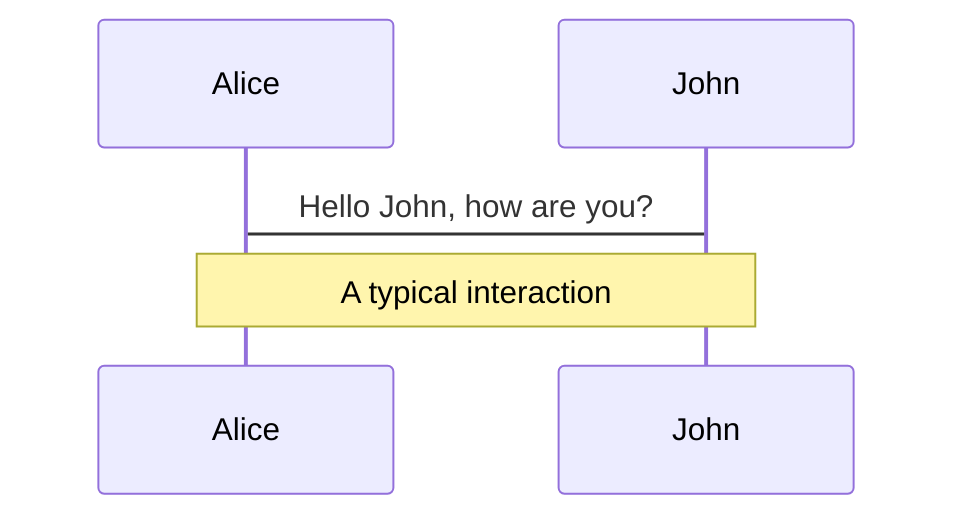
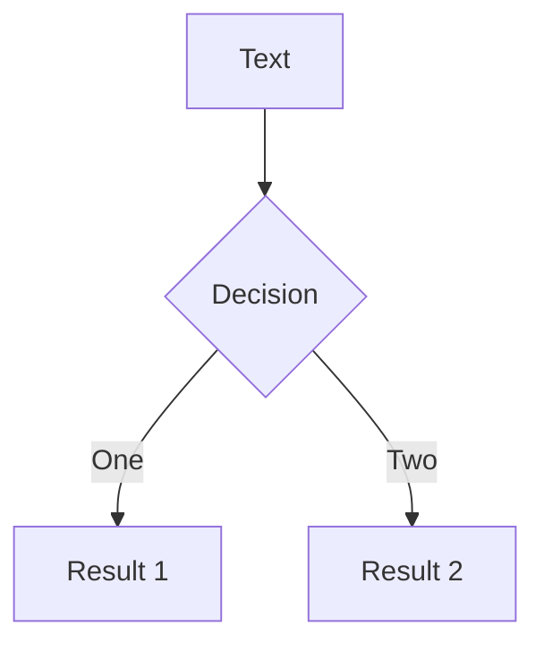
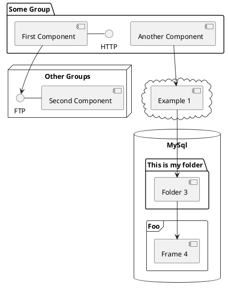

---
# try also 'default' to start simple
theme: seriph
# random image from a curated Unsplash collection by Anthony
# like them? see https://unsplash.com/collections/94734566/slidev
background: https://source.unsplash.com/collection/94734566/1920x1080
# apply any windi css classes to the current slide
class: 'text-center'
# https://sli.dev/custom/highlighters.html
highlighter: shiki
# show line numbers in code blocks
lineNumbers: false
# some information about the slides, markdown enabled
info: |
  ## Slidev Starter Template
  Presentation slides for developers.

  Learn more at [Sli.dev](https://sli.dev)
# persist drawings in exports and build
drawings:
  persist: false
# use UnoCSS (experimental)
css: unocss
---

# 在 JS 项目中引入类型化编程

一些经验分享

<div class="pt-12">
  <span @click="$slidev.nav.next" class="px-2 py-1 rounded cursor-pointer" hover="bg-white bg-opacity-10">
    START <carbon:arrow-right class="inline"/>
  </span>
</div>  

<div class="abs-br m-6 flex gap-2">
  <button @click="$slidev.nav.openInEditor()" title="Open in Editor" class="text-xl icon-btn opacity-50 !border-none !hover:text-white">
    <carbon:edit />
  </button>
  <a href="https://github.com/slidevjs/slidev" target="_blank" alt="GitHub"
    class="text-xl icon-btn opacity-50 !border-none !hover:text-white">
    <carbon-logo-github />
  </a>
</div>

<!--
The last comment block of each slide will be treated as slide notes. It will be visible and editable in Presenter Mode along with the slide. [Read more in the docs](https://sli.dev/guide/syntax.html#notes)
-->

---

# 主题介绍

## 引入类型化编程是什么意思？

通过 TypeScript 引入类型系统和类型检查

## 为什么选这个主题？

---

# 为什么要引入类型化编程？

<div grid="~ cols-2 gap-4">
<div>

## JS 开发现状

- 反复切换文件查看逻辑和上下文？
- 怕写错单词所以经常复制粘贴？
- 经常需要运行代码看是否正确？
- 经常遇到各种运行时错误？
- 重构基本靠搜索替换？


</div>

<div>

## 引入类型化

- 🛡️✅ **更容易写出安全、正确的代码** - 类型检查、边界检查、错误检查，面向接口编程。
- 🚀 **研发效率** - 一次就写出正确的代码，不需要频繁运行和修改。
- 🧑‍💻 **开发体验** - 代码提示和补全。
- 📖⚒️ **易于维护** - 代码即文档，不用反复看源码理解，更容易进行 **重构**。

<div class="h-10"></div>

> 核心：将对程序的设计借助类型系统记录下来，并提供上下文提示以及类型安全检查，解放开发者心智负担。
</div>
</div>

---

# 引入类型化编程的方式？

**TypeScript** yyds

- 借助 TypeScript 的能力
  - 通过 `JsDoc` 注释来添加类型信息
  - 通过 `.d.ts` 文件来添加类型信息
  - 开启类型检查
- 直接将项目升级为 TypeScript 项目
  - 渐进式
  - 一步到位式

---

# 开发环境配置

## 插件

- **TypeScript** 配置项覆盖 JS/TS 开发的方方页面（格式化、语法、类型标注、类型检查等）。
  - Inlay Hints：标注自动推断的类型
  - jsconfig/tsconfig 配置项
  - 格式配置
  - 错误显示
- **ErrorLens** 自动将错误信息直接显示出来，不用再通过鼠标或者快捷键主动查看。
- **TypeScript Hero** 对 import 导入项进行排序及管理。
- **补全和自动导入** 如果有谁的编辑器不行的话，可以一起看下少了什么插件。

## 库

- **typed-install** 安装第3方库时，使用它的命令可以自动安装类型声明包

---

# tsconfig 顶层字段

- **extends** 用来继承其他配置
- **files** 当项目中只有少量文件时，把所有项目列到该选项中就行。
- **include** 用来定义项目包含哪些文件，支持 `glob` 语法，默认值：`**`。
  - glob 规则简述：`*` 匹配 0 到多个字符，`?` 匹配任意单个字符，`**/` 匹配任意目录（任意深度）。
  - 如果配置中不带后缀的话，默认匹配支持的文件类型（`.ts` `.tsx` `.d.ts`，`allowJs` 时还包括 `.js` `.jsx`）。
- **exclude** 仅用来从 `include` 中排除一些文件，配置方式与 `include` 相同。
- **compilerOptions** 其他绝大多数选项都是配置在该选项内。

---

# tsconfig 路径相关

- **baseUrl** 解析文件路径的根目录。默认 `'./'`，此时 `import * fom 'src/config'`，设置 `'./src'` 后： `import * from 'config'`。
- **rootDir** 项目文件根目录，编译生成的目录结构与该目录下目录结构一样。
  - 默认值：为能包含所有 `files` 或者 `include` 定义的所有文件的目录。比如：如果所有文件都在 `src/` 目录下，那就是 `src/`。
- **paths**  类似于 `Webpack` 中的 `alias`，可以使用类似 `'@/components'` 来简化路径。
  - 配置时的路径是 `baseUrl` 为基础的的相对路径。所以需要先配置 `baseUrl`。
  - 配置示例：`"paths": { "@/*": ["src/*]" }`，`"paths": { "utils/*": ["src/utils/*", "lib/utils/*"]}`。
- **outDir** 编译输出文件的根目录。
- **outFile** 如果定义了，所有非模块文件都被一起打包输出到该文件，如果 `module` 选项为 `System` 或 `AMD`，模块系统文件也会被打包到 global 后面。
  - `CommonJS` 和 `ES6` 模块不能通过设置该选项来打包 bundle 文件。

---

# tsconfig 编译及模块相关

- **target** 决定代码编译的目标版本：哪些语法会被降级编译，哪些会被保留。（前提：使用 tsc 编译）。
  - 常用值：`es5` `es6` `es2018` ... `es2022` `esnext`
  - 并会为 `lib` 选项添加对应es版本的内置类型声明。
  - 建议：一般不使用 tsc 编译的话，设置最新的 `es2022` 就好，如果编译不支持的话再降。
- **lib** 提供了JS内置API(`Math`)、不同 ES 版本的语法(`Promise.allSettled` `Map`)、运行环境(`document`)等。
  - es 版本选项：除了像 target 一样的选项外，还可以精确到语法（如 `ES2022.Promise`）
  - 其他选项：`DOM` `DOM.Iterable` `WebWorker`
- **module** 定义最终生成的 JavaScript 文件的模块标准。
  - 包括常用的 `CommonJs` `ES6` `ES2020` `ESNext` 以及 `AMD` `UMD` `System` `Node16` `NodeNext` 等。
- **moduleResolution** 模块路径的解析策略。默认不一定是 `node`，绝大多数情况设置为 `node` 就好。
- **esModuleInterop** 允许 es 模块引入 cjs 模块，且使用 tsc 编译时还会处理原模块没有 default 导出的问题。
  - **allowSyntheticDefaultImports** 跟随 `esModuleInterop` 开启。`import * as X` 可简写成 `import X`。
- **isolatedModules** 保证每个文件都必须能够独立进行编译。当我们使用 `babel` 等其他编译工具来编译 TypeScript 代码时开启。
---

# tsconfig JavaScript 相关

- **allowJs** 开启后可以 `.ts` 文件中引入 `.js` 文件。
- 💡 **checkJs** 对 JavaScript 其他控制是否开启类型检查的方式：
  - **// @ts-check** 将该标记添加到文件顶部，可以单独开启该文件的类型检查。
  - **// @ts-nocheck** 将该标记添加到文件顶部，可以单独关闭该文件的类型检查。
  - 还可以通过 `include` 选项设置哪些属于项目文件从而开启类型检查。
  - ❌ **// @ts-ignore** 忽略下一行的类型错误（不管有没有错误）。不建议：可能不小心把不该忽略的给忽略了，例如之前要忽略的行被删除。
  - **// @ts-expect-error** 当下一行有错误时，不报错，下一行无错误时，会对该注释报错，提醒你删除该注释。

---

# tsconfig 类型检查

- **strict** 开启一系列严格检查选项：
  - **alwaysStrict** 开启 `"use strict"` 模式，且生成的 js 文件也会加上。
  - **strictNullChecks** 对 `null` `undefined` 的赋值类型检查更严格，且对可能为 `null` `undefined` 的变量使用前不进行判断处理会报错。
  - **strictBindCallApply** 对函数的 `call` `bind` `apply` 使用也进行参数类型检查 。
  - **strictFunctionTypes** 函数赋值时，对函数的参数开启类型检查。
  - **strictPropertyInitialization** 类的成员变量必须在声明时或者构造函数中赋初始值。
  - **noImplicitAny** 禁止隐式 `any` 类型（类型推断失败回退到 any）。建议：错误太多来不及处理时可先关闭。
  - **noImplicitThis** 禁止函数内的 this 为隐式 `any`： 函数内使用 this 时，必有明确其类型。
  - **useUnknownInCatchVariables** `try catch` 的 error 类型为 unknown，强制进行错误类型判断。
- **noImplicitOverride** 类继承时，要覆盖父类方法需要主动加上 `override` 标记。
- **noFallthroughCasesInSwitch** `switch case` 中各分支逻辑独立处理（必须有 `break` 或者 `return`)。
- **noImplicitReturns** 防止函数内有分支忘了处理返回值。


---

# tsconfig 其他

- **严格类型检查** 还有其他一些选项可以再去研究一下。
- **skipLibCheck** 跳过 `.d.ts` 文件的类型检查（可能其中有一些冲突），可以在一定程度上提升编译时性能，但会牺牲一定的类型准确性。

---

# 类型声明

### 注意点

注意类型声明和普通 TypeScript 一样有 `模块` 的概念。如果某一个文件中没有任何 `import` 或者 `export` 语句，那它就会被当成一个全局模块来处理，其中定义的变量或者类型都可以直接使用而不需要导入。
否则，该文件内的所有变量或者类型定义都会变成模块内的，需要 `export` 后再由其他模块 `import` 导入来使用。

### 全局声明

- 声明值：
  - `declare var __APP_NAME__: string;`
  - `declare function report(...args: any[]): void;`
  - `declare class User {};`
- 声明接口或者类型
  - `interface Window { JSBridge?: { callNative(method: string, data?: unknown, callback?: (...args: any[]) => void): void } };`
  - `type MyElement = HTMLDivElement | HTMLSpanElement;`
- 声明命名空间
  - `declare namespace GreetingLib { let name: string; interface Options { title: string }; };`
- 模块文件内定义全局声明
  - `declare global { interface String { reverse(): string; } };`

---

# 为一个模块扩展类型声明

```ts

```

---

# What is Slidev?

Slidev is a slides maker and presenter designed for developers, consist of the following features

- 📝 **Text-based** - focus on the content with Markdown, and then style them later
- 🎨 **Themable** - theme can be shared and used with npm packaWges
- 🧑‍💻 **Developer Friendly** - code highlighting, live coding with autocompletion
- 🤹 **Interactive** - embedding Vue components to enhance your expressions
- 🎥 **Recording** - built-in recording and camera view
- 📤 **Portable** - export into PDF, PNGs, or even a hostable SPA
- 🛠 **Hackable** - anything possible on a webpage

<br>
<br>

Read more about [Why Slidev?](https://sli.dev/guide/why)

<!--
You can have `style` tag in markdown to override the style for the current page.
Learn more: https://sli.dev/guide/syntax#embedded-styles
-->

<style>
h1 {
  background-color: #2B90B6;
  background-image: linear-gradient(45deg, #4EC5D4 10%, #146b8c 20%);
  background-size: 100%;
  -webkit-background-clip: text;
  -moz-background-clip: text;
  -webkit-text-fill-color: transparent;
  -moz-text-fill-color: transparent;
}
</style>

---

# Navigation

Hover on the bottom-left corner to see the navigation's controls panel, [learn more](https://sli.dev/guide/navigation.html)

### Keyboard Shortcuts

|     |     |
| --- | --- |
| <kbd>right</kbd> / <kbd>space</kbd>| next animation or slide |
| <kbd>left</kbd>  / <kbd>shift</kbd><kbd>space</kbd> | previous animation or slide |
| <kbd>up</kbd> | previous slide |
| <kbd>down</kbd> | next slide |

<!-- https://sli.dev/guide/animations.html#click-animations -->

<p v-after class="absolute bottom-23 left-45 opacity-30 transform -rotate-10">Here!</p>

---
layout: image-right
image: https://source.unsplash.com/collection/94734566/1920x1080
---

# Code

Use code snippets and get the highlighting directly![^1]

```ts {all|2|1-6|9|all}
interface User {
  id: number
  firstName: string
  lastName: string
  role: string
}

function updateUser(id: number, update: User) {
  const user = getUser(id)
  const newUser = { ...user, ...update }
  saveUser(id, newUser)
}
```

<arrow v-click="3" x1="400" y1="420" x2="230" y2="330" color="#564" width="3" arrowSize="1" />

[^1]: [Learn More](https://sli.dev/guide/syntax.html#line-highlighting)

<style>
.footnotes-sep {
  @apply mt-20 opacity-10;
}
.footnotes {
  @apply text-sm opacity-75;
}
.footnote-backref {
  display: none;
}
</style>

---

# Components

<div grid="~ cols-2 gap-4">
<div>

You can use Vue components directly inside your slides.

We have provided a few built-in components like `<Tweet/>` and `<Youtube/>` that you can use directly. And adding your custom components is also super easy.

```html
<Counter :count="10" />
```

<!-- ./components/Counter.vue -->
<Counter :count="10" m="t-4" />

Check out [the guides](https://sli.dev/builtin/components.html) for more.

</div>
<div>

```html
<Tweet id="1390115482657726468" />
```

<Tweet id="1390115482657726468" scale="0.65" />

</div>
</div>


---
class: px-20
---

# Themes

Slidev comes with powerful theming support. Themes can provide styles, layouts, components, or even configurations for tools. Switching between themes by just **one edit** in your frontmatter:

<div grid="~ cols-2 gap-2" m="-t-2">

```yaml
---
theme: default
---
```

```yaml
---
theme: seriph
---
```


</div>

Read more about [How to use a theme](https://sli.dev/themes/use.html) and
check out the [Awesome Themes Gallery](https://sli.dev/themes/gallery.html).

---
preload: false
---

# Animations

Animations are powered by [@vueuse/motion](https://motion.vueuse.org/).

```html
<div
  v-motion
  :initial="{ x: -80 }"
  :enter="{ x: 0 }">
  Slidev
</div>
```

<div class="w-60 relative mt-6">
  <div class="relative w-40 h-40">
    
    
    
  </div>

  <div
    class="text-5xl absolute top-14 left-40 text-[#2B90B6] -z-1"
    v-motion
    :initial="{ x: -80, opacity: 0}"
    :enter="{ x: 0, opacity: 1, transition: { delay: 2000, duration: 1000 } }">
    Slidev
  </div>
</div>

<!-- vue script setup scripts can be directly used in markdown, and will only affects current page -->
<script setup lang="ts">
const final = {
  x: 0,
  y: 0,
  rotate: 0,
  scale: 1,
  transition: {
    type: 'spring',
    damping: 10,
    stiffness: 20,
    mass: 2
  }
}
</script>

<div
  v-motion
  :initial="{ x:35, y: 40, opacity: 0}"
  :enter="{ y: 0, opacity: 1, transition: { delay: 3500 } }">

[Learn More](https://sli.dev/guide/animations.html#motion)

</div>

---

# LaTeX

LaTeX is supported out-of-box powered by [KaTeX](https://katex.org/).

<br>

Inline $\sqrt{3x-1}+(1+x)^2$

Block
$$
\begin{array}{c}

\nabla \times \vec{\mathbf{B}} -\, \frac1c\, \frac{\partial\vec{\mathbf{E}}}{\partial t} &
= \frac{4\pi}{c}\vec{\mathbf{j}}    \nabla \cdot \vec{\mathbf{E}} & = 4 \pi \rho \\

\nabla \times \vec{\mathbf{E}}\, +\, \frac1c\, \frac{\partial\vec{\mathbf{B}}}{\partial t} & = \vec{\mathbf{0}} \\

\nabla \cdot \vec{\mathbf{B}} & = 0

\end{array}
$$

<br>

[Learn more](https://sli.dev/guide/syntax#latex)

---

# Diagrams

You can create diagrams / graphs from textual descriptions, directly in your Markdown.

<div class="grid grid-cols-3 gap-10 pt-4 -mb-6">







</div>

[Learn More](https://sli.dev/guide/syntax.html#diagrams)


---
layout: center
class: text-center
---

# Learn More

[Documentations](https://sli.dev) · [GitHub](https://github.com/slidevjs/slidev) · [Showcases](https://sli.dev/showcases.html)
